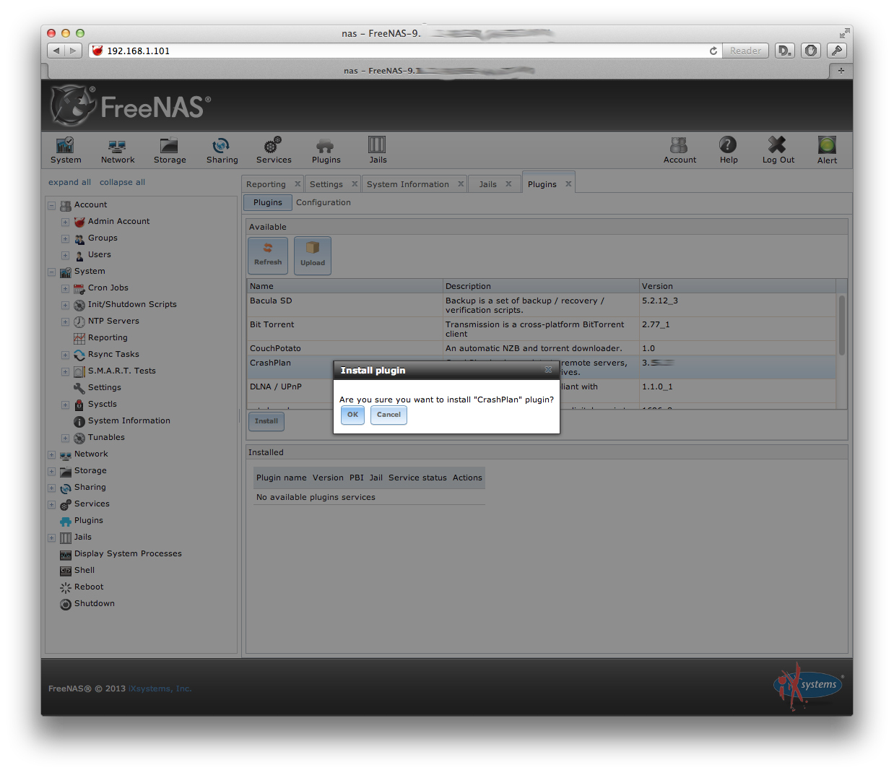
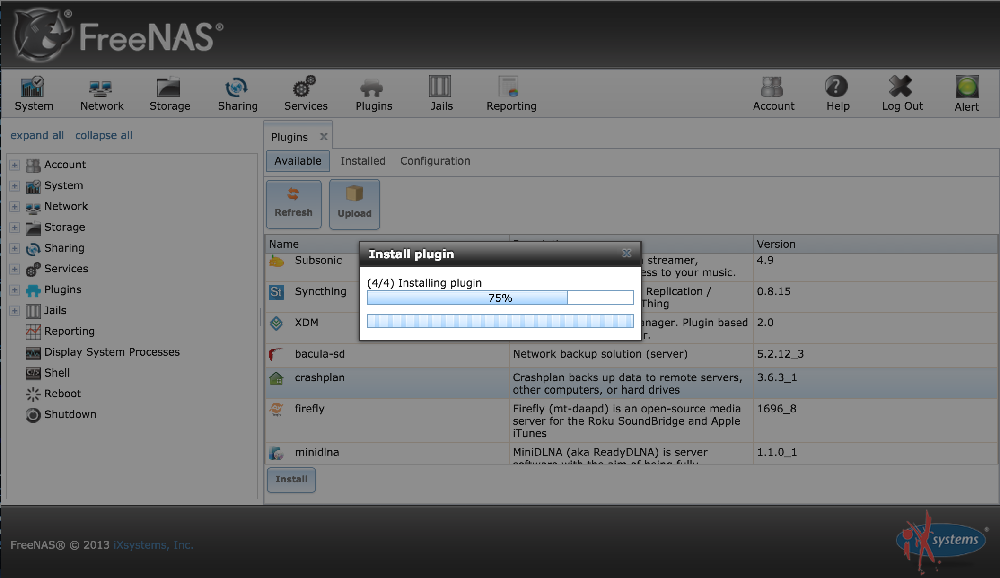
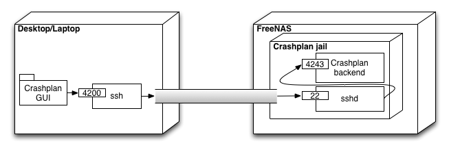
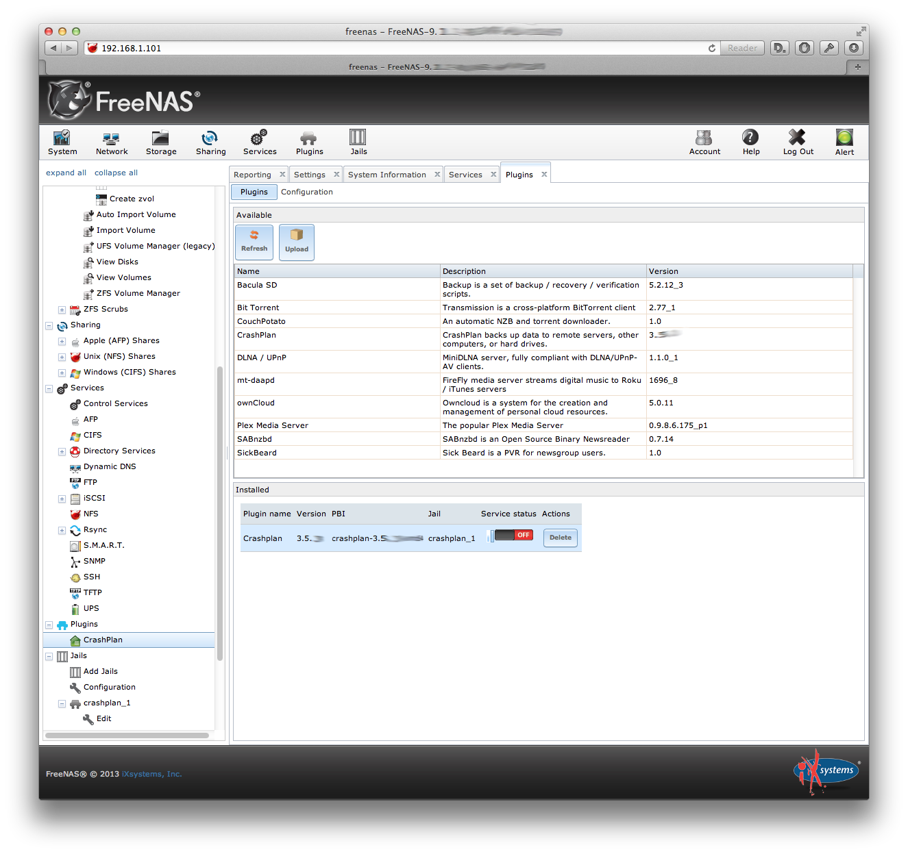
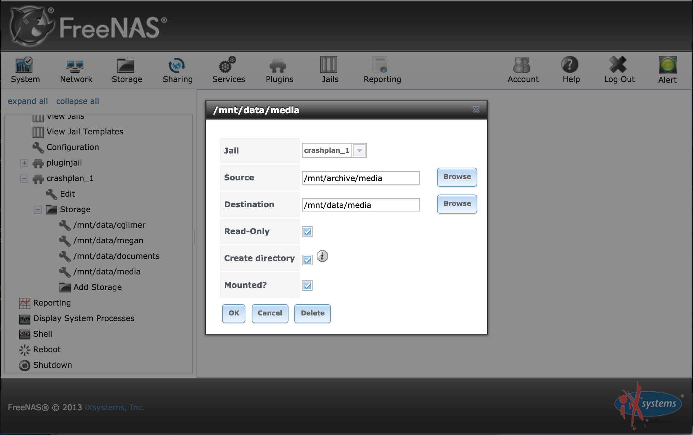

# How-to : Crashplan & Freenas

Pre-requisites

* [Crashplan account (free)](http://www.crashplan.com/)
* FreeNAS-9.3-RELEASE-x64 or older

## Install

### Step 1: Install the Crashplan plugin

Plugins --> Install Crashplan


### Step 2 : Accept TOS



### Step 3 : Create a sshd user for the Crashplan jail, enable TCP forwarding
To configure the Crashplan running inside a FreeNAS jail we need to use another machine that has graphical user interface. The jail has no user interface, only text console. Below is an overview of the connection that lets us use another machines GUI to configure the server running inside headless jail.



To login to jail when no sshd is available in it you must either a) use jexec command on FreeNAS console or b) use the jail console in FreeNAS WebUI.

a) Connect to jail. If you are on FreeNAS login. Note that the JID may be different.
```
[root@freenas] ~# jls
   JID  IP Address      Hostname                      Path
     1  -               crashplan_1                   /mnt/zpool/jails_2/crashplan_1
[root@freenas] ~# jexec 1 /bin/tcsh
```

b) Open terminal to _jail_ from WebUI


Create a new user for ssh-access, note that the user needs to be in group `wheel`.
```
root@crashplan_1:/ # adduser
Username: crashplan
Full name: 
Uid (Leave empty for default): 1001
Login group [crashplan]: 
Login group is crashplan. Invite crashplan into other groups? []: wheel
Login class [default]: 
Shell (sh csh tcsh nologin) [sh]: tcsh
Home directory [/home/crashplan]: 
Home directory permissions (Leave empty for default): 
Use password-based authentication? [yes]: 
Use an empty password? (yes/no) [no]: 
Use a random password? (yes/no) [no]: 
Enter password: 
Enter password again: 
Lock out the account after creation? [no]: 
Username   : crashplan
Password   : *****
Full Name  : 
Uid        : 1001
Class      : 
Groups     : crashplan wheel
Home       : /home/crashplan
Home Mode  : 
Shell      : /bin/tcsh
Locked     : no
OK? (yes/no): yes
pw: mkdir(/home/crashplan): No such file or directory
adduser: INFO: Successfully added (crashplan) to the user database.
Add another user? (yes/no): no
Goodbye!
```

Start the sshd manually:

```
root@crashplan_1:/ # service sshd start
...
```

At this point, I like to copy my pub key to make things easier on me. The 192.168.1.103 here is the IP of the crashplan jail.
You must first find the IP of the jail itself (not the FreeNAS box).  You can find this in the Jails menu.  In this case the instructions show it as `192.168.1.103`:

```
[me@mylaptop] ~$ brew install ssh-copy-id
[me@mylaptop] ~$ ssh-copy-id crashplan@192.168.1.103
```

Now, let's create a tunnel. This will redirect my laptop port 4200 to port 4243 on the crashplan jail. The console will stay open, you may close it when you are done with the step 7.

```
[me@mylaptop] ~$ ssh -L 4200:127.0.0.1:4243 crashplan@192.168.1.103 -N -v -v
```

I prefer to use a script that I can run.  Add a file called `/usr/local/bin/crashplan` with the following content:

```sh
#!/bin/bash

# Port forward to FreeNAS for Crashplan plugin

SERVICE_PORT=`cat /Applications/CrashPlan.app/Contents/Resources/Java/conf/ui.properties | grep servicePort | egrep -v '#' | awk -F "=" '{print $2}'`

CRASHPLAN_USER="crashplan"
CRASHPLAN_JAIL=192.168.1.2
echo "Connecting on Service Port: $SERVICE_PORT"
echo "Expecting Crashplan FreeNAS Jail at: $CRASHPLAN_USER@$CRASHPLAN_JAIL"

# Connect to crashplan
ssh -L $SERVICE_PORT:127.0.0.1:4243 $CRASHPLAN_USER@$CRASHPLAN_JAIL -N
```

### Step 4 : Configure Linux emulation

Upgrade base system.
```
root@crashplan_1:/ # pkg update
root@crashplan_1:/ # pkg upgrade
```

Enable Linux emulation, sshd and crashplan.
```
root@crashplan_1:/ # sysrc crashplan_enable=YES
crashplan_enable: NO -> YES
root@crashplan_1:/ # sysrc linux_enable=YES
linux_enable: NO -> YES
root@crashplan_1:/ # sysrc sshd_enable=YES
sshd_enable: NO -> YES
```

Install userspace layer for Linux compatibility. Otherwise DNS resolution will not work and UTF-8 filenames will be corrupted.
```
root@crashplan_1:/ # pkg install emulators/linux_base-c6
```

**You must now restart the jail from Web-UI to make sure kernel modules are loaded.**

Mock the kernel version to meet the [Crashplan requirements](http://support.code42.com/CrashPlan/4/Getting_Started/Code42_CrashPlan_System_Requirements)
```
root@crashplan_1:/ # echo "compat.linux.osrelease=2.6.32" >> /etc/sysctl.conf
root@crashplan_1:/ # sysctl compat.linux.osrelease=2.6.32
```

Make sure linux emulation file system is mounted inside the jail. Otherwise you will see an warning like "Java HotSpot(TM) Client VM warning: Can't detect initial thread stack location - find_vma failed". 
```
[root@freenas] ~# mount -t devfs dev /mnt/storage/jails/crashplan_1/dev
[root@freenas] ~# mount -t procfs proc /mnt/storage/jails/crashplan_1/proc
[root@freenas] ~# mount -t linprocfs linproc /mnt/storage/jails/crashplan_1/compat/linux/proc
```

### Step 5 : Install Java 1.8

Install Java.
```
root@crashplan_1:/ # cd ~/
root@crashplan_1:/ # gzip -d jdk-8u121-linux-i586.tar.gz
root@crashplan_1:/ # tar -xf jdk-8u121-linux-i586.tar
root@crashplan_1:/ # cp jdk1.8.0_121/jre/lib/i386/jli/libjli.so /lib
root@crashplan_1:/ # mv jdk1.8.0_121 linux-sun-jre1.8.0
root@crashplan_1:/ # mv linux-sun-jre1.8.0 /usr/pbi/crashplan-amd64/
root@crashplan_1:/ # /usr/bin/cpuset -l 0 /usr/pbi/crashplan-amd64/linux-sun-jre1.8.0/bin/java -version
java version "1.8.0_121"
Java(TM) SE Runtime Environment (build 1.8.0_121-b13)
Java HotSpot(TM) Server VM (build 25.121-b13, mixed mode)
```

Update runtime Java version.
```
root@crashplan_1:/ # sed s/1.7.0/1.8.0/g /usr/local/share/crashplan/install.vars > install.vars
root@crashplan_1:/ # mv install.vars /usr/local/share/crashplan/install.vars 
```

Install bash [(it is required during the crashplan automatic updates)](https://bugs.freenas.org/issues/12375)
```
root@crashplan_1:/ # pkg install bash

# crashplan is expecting bash to be in /bin
root@crashplan_1:/ # ln -s /usr/local/bin/bash /bin/bash
```

### Step 6 : Manually update Crashplan and enable Crashplan plugin

Download latest CrashPlan version and extract.
```
root@crashplan_1:/ # cd /usr/pbi/crashplan-amd64/share/crashplan/
root@crashplan_1:/ # wget --no-check-certificate https://download.code42.com/installs/linux/install/CrashPlan/CrashPlan_4.8.0_Linux.tgz
root@crashplan_1:/ # tar -xf CrashPlan_4.8.0_Linux.tgz
root@crashplan_1:/ # cpio -idv < CrashPlan_4.8.0.cpi
root@crashplan_1:/ # cd ..
root@crashplan_1:/ # cp -r crashplan-install/lib* .
```

Add some missing symlinks.
```
root@crashplan_1:/ # cd /usr/local/lib
root@crashplan_1:/ # ln -s libintl.so.8.1.5 libintl.so.9
root@crashplan_1:/ # ln -s libiconv.so.2.5.1 libiconv.so.3
```


### Step 7 : Verify Crashplan is running and listening

```
[root@freenas] ~# jexec crashplan_1 sockstat -4
USER     COMMAND    PID   FD PROTO  LOCAL ADDRESS         FOREIGN ADDRESS
crashplan sshd      4149  5  tcp4   192.168.1.103:22      192.168.1.83:53226
root     sshd       4147  5  tcp4   192.168.1.103:22      192.168.1.83:53226
root     java       3952  56 tcp4   127.0.0.1:4243        *:*
root     java       3952  57 tcp4   *:4242                *:*
root     java       3951  56 tcp4   127.0.0.1:4243        *:*
...
```

The service can be controlled as follows:

```
root@crashplan_1:/ service crashplan restart
```
or ...
```
root@crashplan_1:/ /usr/bin/cpuset -l 0 /usr/local/share/crashplan/bin/CrashPlanEngine restart
```

### Step 8: Mount storage directories

From the FreeNAS GUI you must configure the storage for the jail so that you can back up the filesystem.  This can be done if you go to:

```
Jails -> crashplan_1 -> Storage -> Add Storage
```

You must put in the root `Source` and `Destination` directory and optionally set it to `Read-Only`.  The `Source` is the directory you wish to back up.  The `Destination` is the directory you want to mount it on so Crashplan can read it.  You select `Read-Only` to secure the data against anything in the jail trying to modify your files.  Here is an example:



### Step 9 : Configure Crashplan UI to connect to remote host (through ssh-tunnel)

First download and install the crashplan desktop application.  

https://www.code42.com/crashplan/download/

This is done _on your desktop machine_ (for me it was my laptop), that you use to configure the crashplan service running in the FreeNAS jail.

See [crashplan's documentation](http://support.crashplan.com/doku.php/how_to/configure_a_headless_client)

Configure the desktop (my laptop) to use the ssh tunnel by editing the `ui.properties` file.
Make a backup of the file, if you use the Crashplan on the desktop machine too. This change will divert the
connections to port 4200, so it will not work without the ssh-tunnel and it will not connec to local crashplan
any more.


You may find the `ui.properties` file in the following location:

```
Linux (if installed as root): /usr/local/crashplan/conf/ui.properties
Mac: /Applications/CrashPlan.app/Contents/Resources/Java/conf/ui.properties
Solaris (if installed as root): /opt/sfw/crashplan/conf/ui.properties
Windows: C:\Program Files\CrashPlan\conf\ui.properties
```

Change the service port to 4200, which we will use to tunnel to the remote connection.

```
servicePort=4200
```

### Step 10: Connect with Crashplan UI and update.

Launch the modified Crashplan UI on the desktop (my laptop). Ssh-tunnel must be open. Immediatly after you login the UI will exit and the crasplan plugin will start the update process. This process in incremental, that means that the crasplan plugin will restart itself many times, until reaching the latest version.

You can see how the version numbers increase with
```
tail -f /usr/pbi/crashplan-amd64/share/crashplan/log/app.log | grep CPVERSION
```

Once the update is complete, make sure the client (desktop application) is the same version as the plugin, because even though they are supposed to auto update to the latest version, if there is a difference it will not work. 

### Step 11: Copy the authentication token required after the update

Follow the instruction in this [*Step 1*](http://support.code42.com/CrashPlan/4/Configuring/Using_CrashPlan_On_A_Headless_Computer#Step_1:_Copy_The_Authentication_Token)

You can find the plugin token here
```
root@crashplan_1:/ # cat /var/lib/crashplan/.ui_info
```

### Step 12: Connect with Crashplan UI...Finally!

Now launch the UI client, login and configure your backups.

You may close the ssh-tunnel at this point when the Crashplan UI is closed.

## Other considerations

### Large Backup File Selections

If you are backing up more than 1 TB or 1 million files, please review [additional technical information](http://support.code42.com/CrashPlan/4/Troubleshooting/Adjusting_CrashPlan_Settings_For_Memory_Usage_With_Large_Backups).

## Common Problems

### Cannot connect to crashplan jail over ssh

Sometimes the `sshd` service needs to be restarted.  This is easy:

```sh
[root@freenas] ~# jls
   JID  IP Address      Hostname                      Path
     1  -               crashplan_1                   /mnt/zpool/jails_2/crashplan_1
[root@freenas] ~# jexec 1 /bin/tcsh
root@crashplan_1:/ # service sshd restart
```

### I am not able to connect to the system remotely via GUI anymore

Make sure the versions of the crashplan client (GUI) and the service running in Freenas match, they have to be exactly the same.

Alternatively, logging into [CrashPlan online](https://www.crashplan.com/account/login.vtl) to manage the account provides many relevant functions that one would want to perform via GUI. Effectively, it's a cloud version of the GUI allowing granular configuration changes on any client associated with the account. Once the FreeNAS is up and running and registered to the account, all management can take place via web. (Source [Slovak](https://forums.freenas.org/index.php?threads/crashplan-not-updating.40374/#post-256017))

## I ran into a problem during setup. How do I document and share my experience?

Open an issue. We'll try to get back to you with a workaround, or update the documentation.

## Authors
* Original Author: Petri Sirkkala
* Contributor: Federico Castagnini
* Contributor: Kyösti Herrala
